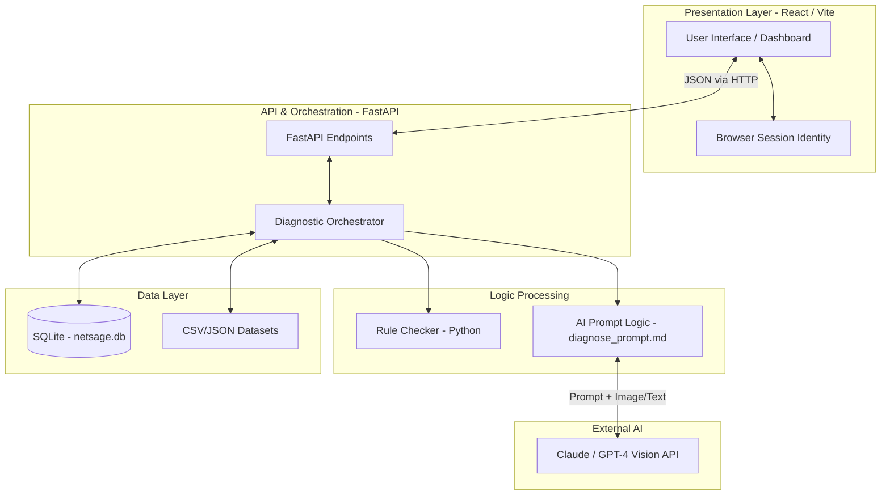

# NetSage AI

NetSage AI is an AI-assisted troubleshooting copilot tailored for Cisco-style lab networks. Designed for Junior Network Engineers, it helps narrow down fault categories while enforcing evidence-based troubleshooting and mandating human oversight.

## What the Project Is
Junior network engineers often struggle to connect a symptom to the real root cause despite knowing individual Cisco commands. When a PC gets an IP address but cannot reach a server, the problem could be a VLAN mismatch, routing issue, DHCP failure, DNS issue, ACL block, or NAT misconfiguration. 

NetSage AI addresses this by acting as a copilot. The engineer provides the symptoms and show-command outputs (as text or screenshots). The system cross-references these with a deterministic rule checker, processes them via an LLM using strict prompt constraints, and suggests a likely fault, the OSI layer, the next command to run, and an evidence-backed fix. A non-negotiable safety rule of the system is that a human reviewer (Junior Engineer or Senior Reviewer) must review and explicitly Accept, Edit, or Reject every AI diagnosis before the fix is considered trusted.

## Contributors
- A M Ismail
- Mohammed Ayaan Adil Ahmed
- Varashree H A
- Yashwanth R

## Architecture & Layers
The architecture leverages a hybrid diagnostic approach, combining AI generative capabilities with deterministic scripting for safety.



### Layer Breakdown:
1. **Frontend (Presentation Layer)**: Built with React, Tailwind CSS, Recharts, and Lucide React. Handles the UI dashboard, multimodal input processing (text and screenshots), and managing the browser-session-based user identity.
2. **Backend (API & Orchestration Layer)**: A Python FastAPI (or Flask) application acting as the bridge. It receives cases from the frontend, orchestrates the analysis pipeline, and formats responses.
3. **Deterministic Logic Layer**: The `rule_checker.py` script. A pure Python, non-AI script that checks configurations for objective errors (duplicate IPs, wrong subnet masks, admin-down interfaces) to serve as an anti-hallucination guardrail.
4. **AI Layer**: Responsible for processing the `diagnose_prompt.md` system constraints along with the case data, and querying Anthropic Claude or OpenAI GPT-4 API (with Vision capabilities for screenshots) to return a structured JSON diagnostic.
5. **Data Layer**: An SQLite database (`netsage.db`) holding state for sessions and case reviews, supplemented by local CSV/JSON files (`cases.csv`) which store the baseline troubleshooting scenarios (minimum 30 cases).

## Tech Stack
- **Frontend**: React (JSX, hooks), Vite, Tailwind CSS (utility classes), Recharts (data visualization), Lucide React (icons)
- **Backend**: Python 3, FastAPI / Flask (`main.py`)
- **Data Storage**: SQLite (`netsage.db`), CSV/JSON files (No heavy external DB required at this scale)
- **AI Layer**: Anthropic Claude or OpenAI GPT-4 API (Vision-capable)
- **Deterministic Logic**: Python Standard Library (`json`, `ipaddress`, `dataclasses`, `argparse`)

## Installation

1. **Clone the repository:**
   ```bash
   git clone https://github.com/yup29-pro/NetSage-AI.git
   cd NetSage-AI
   ```

2. **Start the Backend:**
   ```bash
   cd backend
   pip install -r requirements.txt
   python main.py
   ```
   *The backend will run on `http://127.0.0.1:8000`.*

3. **Start the Frontend:**
   ```bash
   cd ../frontend
   npm install
   npm run dev
   ```
   *The frontend will be available at `http://localhost:5173`.*

---

## Detailed User Documentation

This section explains how end-users (Engineers and Reviewers) operate the NetSage AI platform.

### User Roles & Identity
There is no formal database-backed authentication system. Instead, NetSage relies on lightweight browser session storage.
- **Junior Engineer**: Can submit new diagnoses, review evidence, submit Accept/Edit/Reject decisions on standard cases, and flag complex cases for escalation.
- **Senior Reviewer**: Has all Junior Engineer permissions, plus the exclusive authority to resolve cases that have been escalated.
*Note: Identity (Name, Initials, Role) is configured once per session on the Welcome Screen and persists until the browser session ends or the user manually switches roles.*

### The User Workflow
1. **Encounter Issue:** An engineer encounters a network fault in a Packet Tracer lab and runs initial `show` commands to gather context.
2. **Submit to NetSage:** The engineer navigates to the **New Diagnosis** page, inputs a symptom description, and provides evidence by pasting console text and/or uploading a screenshot.
3. **Run Diagnosis:** Clicking "Run Diagnosis" sends the data through the NetSage backend. The deterministic Rule Checker scans for basic errors, while the AI analyzes the topology and command output. 
4. **Initial Result:** The engineer receives a structured AI response showing Root Cause, OSI Layer, Confidence, Cited Evidence, Next Command, and Suggested Fix. 
5. **Send to Queue:** The engineer sends this diagnosis to the **Review Queue**. The suggested fix is **NOT** applied yet.
6. **Human Review:** A reviewer (could be the same engineer or a peer) opens the case in the Review Queue. They analyze the AI's logic.
   - If accurate, they **Accept** it.
   - If partially correct, they **Edit** it and add a note.
   - If completely wrong, they **Reject** it and add a note.
   - If too complex or uncertain, they **Escalate** it for a Senior Reviewer.
7. **Resolution:** Only after a human has marked the case as Accepted (or Edited to a correct state) does the engineer execute the fix steps in the lab to verify resolution.

### Core Dashboard Pages
- **Overview (Dashboard)**: The landing workspace. Features aggregate statistics (Total Cases, AI-Human Agreement), a Reviewer Verdicts donut chart, Cases by Severity bar chart, and an AI Confidence Calibration chart.
- **Cases**: A master view of the entire dataset. Fully searchable and filterable to find historical faults.
- **New Diagnosis**: The interactive form for querying the AI with symptom text, terminal output, and screenshot uploads.
- **Review Queue**: A holding area for cases awaiting human verification, sorted by severity.
- **My Reviews**: A read-only audit log of cases the current user has already reviewed, filterable by verdict.
- **Escalations**: A specialized queue for cases requiring senior-level oversight (e.g., due to low AI confidence or repeated rejections). Resolution is role-gated to Senior Reviewers.
- **Reports**: An export center to download `cases.csv`, AI Diagnosis Results, Human Review Logs, the Responsible AI PDF, and Rule Checker Output.
- **Responsible AI Log**: A transparency center displaying cases that were Edited or Rejected by humans, highlighting side-by-side comparisons of AI vs. Human and explaining why the AI was corrected.
- **Playbooks**: A searchable library of proven, step-by-step fix procedures for common fault types (e.g., VLAN mismatches, DNS failures).
- **Rule Checker**: A UI for the deterministic Python script, highlighting basic configuration errors caught without AI intervention.

---

## Detailed Developer Documentation

This section is for developers looking to understand the technical goals, constraints, and internal logic of the codebase.

### Project Goals vs. Non-Goals
**Goals:**
- Reduce time spent narrowing down a fault category for junior engineers.
- Enforce evidence-based troubleshooting (AI must cite specific command output).
- Ensure AI suggestions are *never* blindly trusted.
- Demonstrate responsible AI use via a documented correction trail (the Responsible AI Log).

**Non-Goals (Out of Scope):**
- No automatic application of configuration changes via SSH/Telnet.
- No custom model training; the project relies entirely on prompt engineering.
- Not scoped for production enterprise networks (built for Packet Tracer/labs).
- No complex user management/authentication backends.

### Directory Structure & Deliverables
```text
Cisco_NetSage_AI/
├── backend/
│   ├── main.py                # FastAPI entry point, orchestrates endpoints
│   ├── init_db.py             # SQLite setup script
│   ├── netsage.db             # Local database file
│   ├── requirements.txt       # Python dependencies
│   ├── rule_checker.py        # The deterministic Python guardrail script
│   ├── sample_config.json     # Test data for the rule checker
│   ├── diagnose_prompt.md     # The core LLM system prompt instructions
│   └── data/
│       └── cases.csv          # Minimum 30 curated Packet Tracer lab cases
├── frontend/
│   ├── src/                   # React components, hooks, assets
│   ├── public/
│   ├── index.html
│   ├── package.json
│   └── vite.config.js
├── README.md                  # This documentation file
├── PRD.md                     # Product Requirements Document (Single source of truth)
└── TechStack.md               # Detailed architectural and stack decisions
```

### Core Logic Modules
1. **The Prompt Engine (`diagnose_prompt.md`)**:
   - The AI is strictly constrained by this file. It is instructed to output *only* valid JSON.
   - It is explicitly told *not* to hallucinate evidence; if evidence is missing, it must output a Low Confidence score.
   - It uses few-shot prompting (2-3 worked examples) to enforce the JSON schema (`root_cause`, `osi_layer`, `confidence`, `evidence`, `next_command`, `fix_steps`).

2. **The Deterministic Rule Checker (`rule_checker.py`)**:
   - Built to run independently of the LLM. It parses configuration data (like `sample_config.json`).
   - Checks implemented:
     - Duplicate IPs across interfaces.
     - Subnet mask mismatches.
     - Gateway / Switched Virtual Interface (SVI) mismatches.
     - Interfaces administratively down.
     - VLAN assignment mismatches.
     - Missing static routes.

3. **Multimodal Processing**:
   - The frontend accepts both text and images.
   - When an image (screenshot of a terminal or topology) is provided, it is passed to a Vision-capable endpoint (e.g., GPT-4V or Claude 3).
   - Text is treated as the authoritative source if both text and images contain overlapping information.

### Success & Grading Metrics
Developers should ensure the system meets these criteria:
- **Case Coverage**: At least 30 distinct cases covering VLAN, DHCP, DNS, Routing, ACL, NAT, Wireless, Trunking, and Interface faults.
- **Evidence Use**: The AI must physically cite real values from the `show` commands in its output.
- **Human Oversight**: The system must log Accepted, Edited, and Rejected states accurately.
- **Responsible AI Log**: The system must contain at least 5 cases where the AI answer was actively corrected by a human reviewer, with a clear explanatory note.
- **Deterministic Accuracy**: The `rule_checker.py` script must successfully flag injected config errors.
